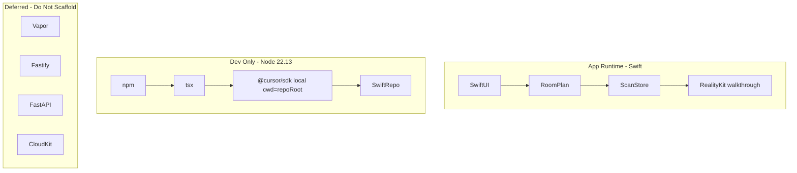
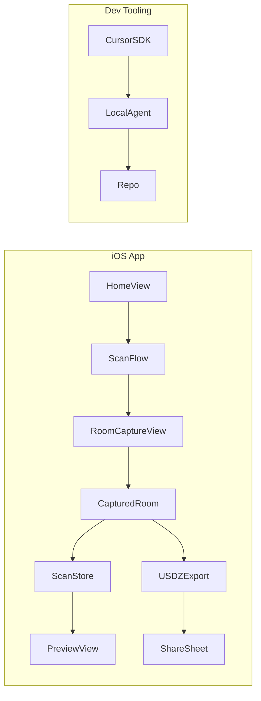
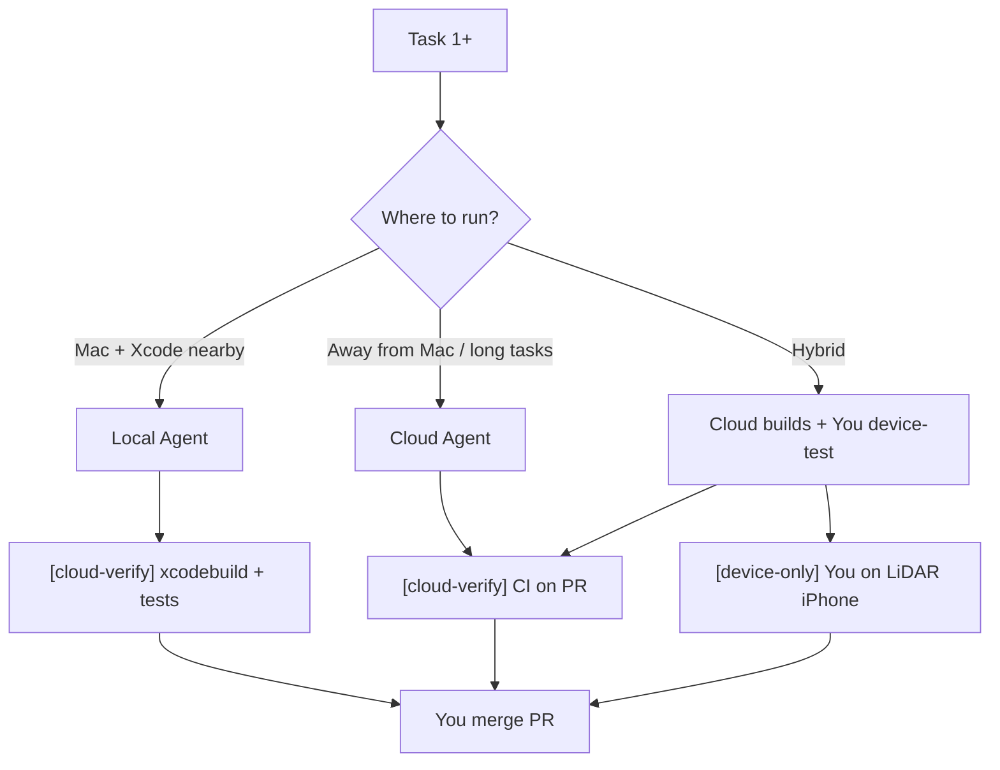

# SceneShift MVP Bootstrap Plan

> **For agentic workers:** REQUIRED SUB-SKILL: Use superpowers:subagent-driven-development (recommended) or superpowers:executing-plans to implement this plan task-by-task. Steps use checkbox (`- [ ]`) syntax for tracking.

**Goal:** Ship a LiDAR-capable iOS app that scans a room, saves it locally, previews the capture, and exports/shares USDZ—without premature backend or custom spatial pipelines.

**Architecture:** Use Apple's **RoomPlan** (`RoomCaptureView` + `CapturedRoom`) for scanning and USDZ export instead of building a custom ARKit mesh pipeline. SwiftUI for navigation; a thin `ScanStore` service for local persistence via `CapturedRoom`'s Codable support. A separate **`scripts/`** TypeScript package uses `@cursor/sdk` (local runtime, `Agent.create` + `run.wait()`) for dev automation only — not app runtime, not a production API server.

**Tech Stack:** Swift 5.9+, SwiftUI, RoomPlan, ARKit, RealityKit, iOS 17+, Xcode 15+, **SPM only** (no CocoaPods). Dev tooling: **Node 22.13+**, **npm**, TypeScript ESM, **tsx**, `@cursor/sdk` (pinned, not `latest`). Share still sends USDZ (receivers may open it in system Quick Look).

## Global Constraints

- **Platform:** iOS native only for v1; LiDAR device required for scanning (iPhone 12 Pro+ / iPad Pro 2020+).
- **Deployment target:** iOS 17.0 (RoomPlan export APIs stable; aligns with `.gitignore` Xcode setup).
- **On-device only:** No custom HTTP/REST/GraphQL backend, auth, or cloud sync in this milestone. Apple first-party APIs only.
- **Frameworks over custom code:** RoomPlan for scan + export + coaching + dimensions; RealityKit non-AR walkthrough for in-app preview; no custom mesh reconstruction, floor-plan ML, or third-party scan SDKs. Do not wrap `QLPreviewController` for in-app preview. Share still sends USDZ.
- **YAGNI folder rule:** Only create directories/files listed in this plan; no empty "future" modules (no `Networking/`, `Auth/`, `API/`, `ML/` yet).
- **Do not vendor-integrate:** Matterport, Polycam, magicplan, Canvas, CubiCasa, Cesium, Omniverse, BIM/IFC APIs. Those are competing products or later-phase toolchains, not v1 dependencies.

---

## Official Reference Documentation (required reading)

All implementation tasks must follow these primary sources — not blog posts or pretrained assumptions.

### 1. Swift language & ecosystem — [swift.org/documentation](https://www.swift.org/documentation/)

| Topic | Official doc | How SceneShift uses it |
|-------|--------------|------------------------|
| Language & naming | [The Swift Programming Language](https://www.swift.org/documentation/) (TSPL) | All Swift code |
| Public API style | [API Design Guidelines](https://www.swift.org/documentation/) | `ScanStore`, `SavedScan`, view model names |
| Dependencies | [Swift Package Manager](https://www.swift.org/documentation/) → [Package Manager docs](https://docs.swift.org/swiftpm/documentation/packagemanagerdocs/) | iOS deps via Xcode/SPM; **no CocoaPods** |
| Creating packages | [Creating a Swift package](https://docs.swift.org/swiftpm/documentation/packagemanagerdocs/creatingswiftpackage) | Later: extract shared modules if app grows |
| Adding deps | [Adding dependencies to a Swift package](https://docs.swift.org/swiftpm/documentation/packagemanagerdocs/addingdependencies) | When a third-party Swift lib is needed |
| Tests | XCTest (via TSPL / Xcode) | `SceneShiftTests/` |
| In-app docs | [DocC](https://www.swift.org/documentation/) | Defer; use when publishing a Swift package |
| Concurrency | [Enabling Complete Concurrency Checking](https://www.swift.org/documentation/) | Enable in Xcode build settings when moving to Swift 6 |
| Server (later) | [Swift on Server](https://www.swift.org/documentation/) article | Points to **Vapor** if backend stays Swift — not FastAPI |

Swift.org lists **Cursor** as a supported editor — aligns with `scripts/` Cursor SDK tooling.

**MVP SwiftPM shape:** Xcode `.xcodeproj` app linking **system frameworks** (`RoomPlan`, `ARKit`). No root `Package.swift` until a shared Swift module is extracted per [Creating a Swift package](https://docs.swift.org/swiftpm/documentation/packagemanagerdocs/creatingswiftpackage).

### 2. RoomPlan (spatial capture API) — [developer.apple.com/documentation/roomplan](https://developer.apple.com/documentation/roomplan)

Apple’s authoritative API for LiDAR room scanning. Key pages mapped to tasks:

| Plan task | RoomPlan doc | API to use |
|-----------|--------------|------------|
| Task 3 scan UI | [Create a 3D model… (Essentials)](https://developer.apple.com/documentation/roomplan/create-a-3d-model-of-an-interior-room-by-guiding-the-user-through-an-ar-experience), [`RoomCaptureView`](https://developer.apple.com/documentation/roomplan/roomcaptureview) | Framework-provided scan view + built-in instructions |
| Task 3 custom path (later) | [`RoomCaptureSession`](https://developer.apple.com/documentation/roomplan/roomcapturesession), [`RoomCaptureSessionDelegate`](https://developer.apple.com/documentation/roomplan/roomcapturesessiondelegate) | Only if leaving `RoomCaptureView` |
| Task 2 persist | [`CapturedRoom`](https://developer.apple.com/documentation/roomplan/capturedroom) (Codable) | `encode`/`decode` to disk |
| Task 4 export | [`USDExportOptions`](https://developer.apple.com/documentation/roomplan/capturedroom/usdexportoptions), export methods on `CapturedRoom` | USDZ for share/preview |
| Task 8 dimensions | [Access the captured results](https://developer.apple.com/documentation/roomplan#Access-the-captured-results) — parametric `Surface`/`Object` | List dimensions + confidence; Apple’s stated use case: *“Estimate the size of particular areas of a room”* |
| Defer multi-room | [Scanning the rooms of a single structure](https://developer.apple.com/documentation/roomplan/scanning-the-rooms-of-a-single-structure), [`StructureBuilder`](https://developer.apple.com/documentation/roomplan/structurebuilder) | After single-room MVP |
| Defer post-process | [`RoomBuilder`](https://developer.apple.com/documentation/roomplan/roombuilder) | If switching to session-based capture |

**Platform note from Apple docs:** capture requires iOS/iPadOS LiDAR device; [Mac Catalyst can encode/decode/export `CapturedRoom` but cannot scan](https://developer.apple.com/documentation/roomplan#Process-scan-results-on-macOS-with-Mac-Catalyst).

### 3. FastAPI full-stack template — [github.com/fastapi/full-stack-fastapi-template](https://github.com/fastapi/full-stack-fastapi-template)

**Do NOT clone into SceneShift for MVP.** That template is a **web app** (FastAPI + **React** + PostgreSQL + JWT + Docker Compose + Playwright) — see [FastAPI project generation docs](https://fastapi.tiangolo.com/project-generation/). SceneShift v1 is a **native iOS app with no web client and no backend**.

| Template includes | SceneShift MVP needs? | Verdict |
|-------------------|----------------------|---------|
| FastAPI + SQLModel + PostgreSQL | No backend yet | **Defer** |
| React + Vite + Tailwind frontend | iOS is the UI | **Reject** — wrong client |
| JWT auth + email recovery | No accounts yet | **Defer** |
| Docker Compose + Traefik | No server yet | **Defer** |
| Pytest patterns | N/A until Python backend | Reference only |

**When to use this template (Phase 2+ only):** If product requires **Python server-side ML** (batch spatial processing, heavy inference) AND a **web admin dashboard**. Then:

1. Create a **separate repo** (or `backend/` monorepo folder) from [Use this template](https://github.com/fastapi/full-stack-fastapi-template)
2. **Strip or ignore `frontend/`** — iOS app talks to FastAPI via REST/OpenAPI, not React
3. Keep: `backend/` (FastAPI, SQLModel, Pytest, Docker), OpenAPI client generation patterns
4. **Prefer instead if team stays Swift:** [Swift on Server](https://www.swift.org/documentation/) → **Vapor** (same language as iOS app, shared types)

**Wrong move:** Adding `backend/`, `frontend/`, `compose.yml`, `pyproject.toml`, or `bun.lock` from the FastAPI template to the SceneShift MVP repo.

### 4. Cursor SDK (dev scripts only) — [cursor.com/docs/sdk/typescript](https://cursor.com/docs/sdk/typescript)

Separate from FastAPI — Node 22.13+, npm, `scripts/` package. See Task 5 (local + cloud CLIs).

---

## Cloud Agent Handoff & Continuation

Goal: you can **stop locally, push to GitHub, and resume in [Cursor Cloud Agents](https://cursor.com/docs/cloud-agent)** (Desktop → Cloud, Web, API, or SDK) without the agent losing context or hitting avoidable blockers.

Sources: [Cloud Agents docs](https://cursor.com/docs/cloud-agent), [Cloud Agents API](https://cursor.com/docs/cloud-agent/api/overview), [TypeScript SDK cloud runtime](https://cursor.com/docs/sdk/typescript).

### Prerequisites (one-time, before first cloud handoff)

1. **Push repo to GitHub** (or GitLab) — cloud agents clone from remote; an empty local-only repo cannot be handed off.
2. **Connect repo in Cursor** — admin connects GitHub with **read-write** access ([Cloud Agents → repository connection](https://cursor.com/docs/cloud-agent#repository-provider-connection)).
3. **Commit handoff files** (Task 0): spec, plan, `AGENTS.md`, `PROGRESS.md` — agents read the repo, not your local `.cursor/plans/` cache.

### What cloud agents CAN vs CANNOT do for SceneShift

| Work | Cloud agent | Local / you |
|------|-------------|-------------|
| Swift/SwiftUI code, ScanStore, UI | Yes | Yes |
| `xcodebuild` + XCTest on macOS VM | Yes (after Task 0 CI stub) | Yes |
| `scripts/` typecheck, SDK cloud dispatch | Yes | Yes |
| RoomPlan **live LiDAR scan** on device | **No** — no physical iPhone on VM | **You** — manual device checklist |
| Xcode GUI signing/provisioning | Limited — document in `AGENTS.md` | You run on device first time |

Each task in this plan labels verification: **`[cloud-verify]`** (CI/simulator) vs **`[device-only]`** (human).

### Repo files for continuation (Task 0)

```
SceneShift/
├── AGENTS.md                          # Agent entrypoint: stack, constraints, current task
├── PROGRESS.md                        # Living checklist: task N status, branch, bc- agent IDs
├── docs/superpowers/
│   ├── specs/2026-08-18-sceneshift-mvp-design.md
│   └── plans/2026-08-18-sceneshift-bootstrap.md   # copy of this plan (committed)
└── .github/workflows/ci.yml           # cloud-verify: xcodebuild test + scripts typecheck
```

**`AGENTS.md` must include:**
- Link to design spec + implementation plan
- Official doc links (swift.org, RoomPlan, SwiftPM)
- Global constraints (no FastAPI template clone, no Bun, Node 22.13+)
- Current task from `PROGRESS.md`
- Explicit: "Do not block on LiDAR device testing — mark `[device-only]` steps for human"

**`PROGRESS.md` format:**

```markdown
## Current
- Task: 3 — Room Scan Flow
- Branch: feat/task-3-room-scan
- Last cloud agent: bc-xxxxxxxx (optional)
- Blockers: none

## Completed
- [x] Task 0 — spec + handoff files
- [x] Task 1 — Xcode shell
```

Update `PROGRESS.md` at the **end of every task** before push.

### Branch & PR convention (cloud-friendly)

- One branch per task: `feat/task-N-short-name`
- Cloud agent opens PR via SDK `autoCreatePR: true`
- Set `skipReviewerRequest: true` for unattended runs ([SDK docs](https://cursor.com/docs/sdk/typescript))
- PR body references task number + `[cloud-verify]` results
- **You** merge when ready; next cloud agent uses `startingRef: main`

### SDK: local vs cloud scripts (Task 5)

| Script | Runtime | Use when |
|--------|---------|----------|
| `npm run prompt -- "..."` | **local** | Quick iteration on your Mac |
| `npm run review` | **local** | Pre-commit review |
| `npm run cloud:task -- 3` | **cloud** | Hand off Task 3 to Cursor VM; opens PR |
| `npm run cloud:resume -- bc-xxx` | **cloud** | Continue prior cloud agent |

Cloud dispatch uses explicit config ([SDK requirement](https://cursor.com/docs/sdk/typescript)):

```typescript
cloud: {
  repos: [{ url: process.env.SCENESHIFT_REPO_URL!, startingRef: process.env.SCENESHIFT_BASE_BRANCH ?? "main" }],
  autoCreatePR: true,
  skipReviewerRequest: true,
}
```

Env vars in `scripts/.env.example`:

```
CURSOR_API_KEY=
SCENESHIFT_REPO_URL=https://github.com/YOU/SceneShift
SCENESHIFT_BASE_BRANCH=main
```

Prompt for `cloud:task` includes: read `AGENTS.md`, `PROGRESS.md`, plan task N, implement, run `[cloud-verify]` checks, update `PROGRESS.md`, commit.

### Resume across sessions

- **Cloud agent ID** (`bc-…`): resume via Cursor UI, API, or `Agent.resume(id)` / `npm run cloud:resume`
- **Local agent ID** (`agent-…`): local only
- Inline MCP servers **not persisted** on resume — re-pass if needed ([SDK skill](https://cursor.com/docs/sdk/typescript))

### Minimal CI for cloud-verify (Task 0)

```yaml
# .github/workflows/ci.yml — macOS runner (jobs skip until paths exist)
# ios-test (after Task 1):
- xcodebuild test -scheme SceneShift -destination 'platform=iOS Simulator,name=iPhone 16'  # or generic: 'platform=iOS Simulator,OS=latest'
# scripts-check (after Task 5):
- cd scripts && npm ci && npm run typecheck
```

Cloud agents use this as the verification loop instead of guessing. LiDAR steps stay out of CI.

---

## Workspace & Editor Config (where files live + which skill scaffolds them)

SceneShift is a **polyglot repo** (Swift/Xcode + Node `scripts/`). Config splits by purpose — do not mix user-global settings into the repo.

### File locations (all committed in Task 0)

| Path | Purpose | Who uses it |
|------|---------|-------------|
| [`.vscode/settings.json`](.vscode/settings.json) | **Workspace** editor settings (Swift/TS paths, `files.exclude`, format) | Cursor + VS Code |
| [`.vscode/extensions.json`](.vscode/extensions.json) | Recommended extensions (Swift, etc.) | Cursor extension prompts |
| [`.vscode/tasks.json`](.vscode/tasks.json) | Run `xcodebuild test`, `npm run typecheck` from IDE | You + agents |
| [`.cursor/rules/*.mdc`](.cursor/rules/) | **Persistent AI rules** for this project | Cursor Agent (local + cloud) |
| [`.cursor/cli.json`](.cursor/cli.json) | Optional CLI overrides when using Cursor CLI in this repo | Cursor CLI |
| [`.cursor/hooks.json`](.cursor/hooks.json) | Agent event hooks (audit, gate commands) | Cursor Agent — **defer** unless requested |
| [`AGENTS.md`](AGENTS.md) | Human + agent onboarding (stack, handoff) | Cloud + local agents |
| [`PROGRESS.md`](PROGRESS.md) | Current task / branch / `bc-` ID | Cloud handoff |
| `docs/superpowers/` | Design spec + implementation plan | Cloud handoff |

**Not in repo** (user machine only):

| Path | Skill | Notes |
|------|-------|-------|
| `~/Library/Application Support/Cursor/User/settings.json` | **update-cursor-settings** | Font, theme — personal, not project |
| `~/.cursor/cli-config.json` | **update-cli-config** | Global CLI; project overrides go in `.cursor/cli.json` |
| `~/.cursor/plans/` (IDE cache) | — | Copy plan into `docs/superpowers/plans/` for cloud |

### Built-in Cursor skills that scaffold this (use at execution)

There is **no single “scaffold workspace” skill**. Task 0 uses these together:

| Skill | What it scaffolds | When |
|-------|-------------------|------|
| **[create-rule](~/.cursor/skills-cursor/create-rule/SKILL.md)** | `.cursor/rules/*.mdc` with YAML frontmatter | **Primary** — project AI conventions |
| **create-hook** | `.cursor/hooks.json` + scripts | Defer — only if you want agent gates/audit |
| **update-cursor-settings** | User `settings.json` only | Personal editor prefs, not repo |
| **update-cli-config** | `.cursor/cli.json` (project) or global CLI config | Optional CLI tuning |
| **[new-repo](~/.cursor/skills-cursor/new-repo/SKILL.md)** + **origin** | Cursor-hosted git remote + push | Alternative to GitHub; cloud agents need **some** remote |
| **share** | Same as new-repo, novice framing | Getting repo online |

For **GitHub** (already in cloud handoff plan): use `gh`/GitHub remote instead of `origin` CLI — both work with [Cloud Agents](https://cursor.com/docs/cloud-agent).

### Task 0 workspace scaffold (concrete)

**`.vscode/settings.json`** (minimal):

```json
{
  "files.exclude": { "**/.build": true, "scripts/node_modules": true },
  "search.exclude": { "scripts/node_modules": true },
  "typescript.tsdk": "scripts/node_modules/typescript/lib",
  "editor.formatOnSave": true
}
```

**`.vscode/extensions.json`**:

```json
{
  "recommendations": [
    "sswg.swift-lang",
    "sweetpad.sweetpad"
  ]
}
```

(Sweetpad optional — improves Xcode integration from Cursor; agent can build via tasks/CI either way.)

**`.vscode/tasks.json`**:

```json
{
  "version": "2.0.0",
  "tasks": [
    { "label": "SceneShift: Test (Simulator)", "type": "shell", "command": "xcodebuild test -scheme SceneShift -destination 'platform=iOS Simulator,name=iPhone 16'" },
    { "label": "scripts: typecheck", "type": "shell", "options": { "cwd": "scripts" }, "command": "npm run typecheck" }
  ]
}
```

**`.cursor/rules/sceneshift-global.mdc`** — use **create-rule** skill, `alwaysApply: true`:

```markdown
---
description: SceneShift stack constraints and handoff
alwaysApply: true
---

- iOS: Swift/SwiftUI/RoomPlan only; no CocoaPods, no FastAPI template clone
- scripts/: Node 22.13+, npm, not Bun; @cursor/sdk pinned
- Read AGENTS.md + PROGRESS.md before multi-file work
- LiDAR device tests are [device-only]; do not block on them
```

**`.cursor/rules/swift-ios.mdc`** — `globs: **/*.swift` — RoomPlan APIs, API Design Guidelines from swift.org

**`.cursor/rules/scripts-typescript.mdc`** — `globs: scripts/**/*.ts` — ESM, NodeNext, local vs cloud SDK patterns

---
- **Cursor SDK:** Local runtime for dev loops; **Cloud runtime** for handoff/resume across machines. See [Cloud Agent Handoff](#cloud-agent-handoff--continuation) section. Never commit `CURSOR_API_KEY`.
- **iOS deps:** Swift Package Manager only — no CocoaPods, no Carthage (`.gitignore` has Carthage entries from Xcode template; do not add Carthage deps).

---

## Approach Decision (why not build from scratch)

Three options were considered:

| Approach | Pros | Cons | Verdict |
|----------|------|------|---------|
| **A. RoomPlan + SwiftUI (recommended)** | Apple-maintained scan UI, wall/object detection, built-in USDZ export | Less low-level control | **Use for MVP** |
| B. Raw ARKit mesh anchors | Full control over mesh | Weeks of work; duplicates Apple | Defer |
| C. RoomPlan + custom backend from day 1 | Sync ready | Empty API with no client need yet | Defer |

**Explicitly deferred (do not scaffold now):**
- Custom HTTP API (Vapor / FastAPI / Node). Research: local-only is the correct v1; CloudKit is next for metadata sync, custom REST only when large USDZ/BIM/collaboration appear. CloudKit `CKAsset` max is ~50 MB — too small for many USDZ scans, so CloudKit is not a silent later swap-in for 3D files.
- Auth, user accounts, StoreKit
- Third-party scan/cloud SDKs (Matterport, Polycam, magicplan, Canvas)
- Custom LiDAR point-cloud processing / Object Capture (`PhotogrammetrySession`)
- Furniture layout optimization; Apple **Foundation Models** (`LanguageModelSession`) for on-device "optimize" copy — iOS 26+, Apple Intelligence devices only
- Multi-room merge (`StructureBuilder` → `CapturedStructure`) until single-room works; Apple recommends ~2,000 sq ft single-floor residential
- 2D CAD/DXF/BIM export (that's what magicplan/Polycam sell on top of RoomPlan)
- macOS, visionOS, Android, cross-platform
- `BGTaskScheduler` large-export backgrounding until export is slow on device

---

## API Landscape (Tavily research, Aug 2026)

Sources: [RoomPlan docs](https://developer.apple.com/documentation/roomplan), [CapturedRoom](https://developer.apple.com/documentation/roomplan/capturedroom), [Scanning a structure](https://developer.apple.com/documentation/roomplan/scanning-the-rooms-of-a-single-structure), [WWDC22 10127](https://developer.apple.com/videos/play/wwdc2022/10127), [WWDC23 10192](https://developer.apple.com/videos/play/wwdc2023/10192), [isCoachingEnabled](https://developer.apple.com/documentation/roomplan/roomcapturesession/configuration/iscoachingenabled), [CloudKit size limits](https://developer.apple.com/library/archive/documentation/DataManagement/Conceptual/CloudKitWebServicesReference/PropertyMetrics.html), [Foundation Models](https://www.apple.com/newsroom/2025/09/apples-foundation-models-framework-unlocks-new-intelligent-app-experiences), [it-jim RoomPlan limits](https://www.it-jim.com/blog/apple-roomplan-api), [KIRI 2026 LiDAR apps](https://www.kiriengine.app/blog/best-lidar-3d-scanner-apps-iphone-2026), [magicplan Auto-Scan](https://help.magicplan.app/auto-scan-your-floor-plan).

### First-party APIs to use now (already exist — do not reimplement)

| Need | Use this | Do not build |
|------|----------|--------------|
| Scan UI + coaching | `RoomCaptureView` (instructions, overlays, dollhouse) | Custom AR overlay or homemade "move slower / add light" copy |
| Custom scan UI later | `RoomCaptureSession` + `captureSession(_:didProvide:)` `Instruction` with `isCoachingEnabled` | Guessing lighting heuristics |
| Persist room | `CapturedRoom` Codable | Custom schema |
| Dimensions | `CapturedRoom.Surface` / `Object` `dimensions` + `confidence` | Measurement engine or laser-API |
| Object types | RoomPlan taxonomy (walls, doors, windows, openings, floors, ~16 household objects) | Custom detector |
| Export 3D | `capturedRoom.export(to:exportOptions:)` USD/USDZ | Mesh pipeline |
| Preview | RealityKit non-AR walkthrough (`RoomPreviewView` / `RoomWalkthroughARView`) | `QLPreviewController` wrapper for in-app preview |
| Shared USDZ | System Quick Look on the receiving device (AirDrop/Files) | Custom share renderer |
| Post-process | `RoomBuilder(options: [.beautifyObjects])` if using session path | Custom beautify |

### First-party APIs that look like "backend" but are not

- **CloudKit / iCloud Documents** — Apple sync without a REST server. Defer: 50 MB asset cap vs large USDZ; metadata-only sync is the later pattern.
- **Foundation Models** (iOS 26) — on-device LLM, no API fees, privacy-preserving. This is the path for README "on-device intelligence," not FastAPI. Defer until capture/preview is solid; requires Apple Intelligence hardware.
- **App Intents** — Siri/Shortcuts surface. Defer.
- **StoreKit** — only if charging. Defer.

### Third-party APIs / products — do not add as dependencies

Competitors in this category **are apps built on RoomPlan**, not APIs SceneShift should call:

- [magicplan LiDAR Auto-Scan](https://help.magicplan.app/auto-scan-your-floor-plan) uses RoomPlan, then adds 2D floor plans, estimates, DXF.
- Polycam / Matterport / Canvas / CubiCasa sell floor plans, CAD, collaboration, hardware cameras. Matterport CAD typically needs their Pro camera, not a phone SDK.
- Integrating those would duplicate product, add cost, and fight the "don't build unused layers" goal.

### Product gaps RoomPlan-only apps hit (document in spec; only some are MVP)

Apple/research limits to put in README, not to "fix" with custom code:

- Best for ~30×30 ft (9×9 m) residential rooms; lighting ≥ ~50 lux; avoid scans longer than ~5 minutes (thermal/drift) — [WWDC22 10127](https://developer.apple.com/videos/play/wwdc2022/10127)
- Rectangular simplification; limited object set; not industrial/precision; reported ~±5 cm wall drift; walls modeled ~16 cm thick — [it-jim](https://www.it-jim.com/blog/apple-roomplan-api)
- Multi-room: `StructureBuilder` / `CapturedStructure`; WWDC23: ~2,000 sq ft single-floor residential; keep ARSession alive across rooms via `stop(pauseARSession: false)`
- **Missing vs competitors if we only ship USDZ Quick Look (share path):** 2D floor plan view, editable wall dimensions, DXF/PDF export. Those are later features *on top of* `CapturedRoom` parametric data — still no HTTP API. In-app preview is a RealityKit walkthrough; Quick Look remains the **share receiver** limitation, not the in-app viewer.

### Correction to earlier plan (coaching)

Task 3 previously invented custom quality hints. **Wrong.** `RoomCaptureView` already shows instructional text. If we stay on `RoomCaptureView`, do not duplicate coaching. Custom `Instruction` handling is only if we switch to `RoomCaptureSession`.

---

## Stack Decision Matrix (Tavily research, Aug 2026)

Sources: [Cursor TypeScript SDK](https://cursor.com/docs/sdk/typescript), [SDK changelog](https://cursor.com/docs/sdk/changelog), [Cursor forum Bun/Node](https://forum.cursor.com/t/local-cursor-sdk-agents-fail-with-opaque-running-error-on-local-repos/160589), [RoomPlan](https://developer.apple.com/documentation/roomplan), [Vapor](https://vapor.codes), [iOS CI comparison](https://capawesome.io/blog/comparing-ci-cd-platforms-for-ios-apps).

### iOS app (runtime)

| Choice | Verdict | Why | Reject |
|--------|---------|-----|--------|
| **Swift + SwiftUI + RoomPlan** | **Use** | Only first-class path to LiDAR room capture + parametric export on iOS | — |
| RealityKit in-app walkthrough | **Use** | `ARView(cameraMode: .nonAR)` in `RoomPreviewView` / `RoomWalkthroughARView` | Wrapping `QLPreviewController` for in-app preview |
| AR furniture / object placement | Defer | Later RealityKit AR; walkthrough preview stays non-AR | Building furniture placement now |
| Unity / Unreal | Reject v1 | Extra bundle size, glue to native AR APIs | [Davey Knific comparison](https://www.daveyknific.com/journal/realitykit-vs-ar-foundation.html) |
| React Native / Flutter RoomPlan plugins | Reject v1 | Not first-class Apple APIs; limits AR control | [expo-roomplan](https://github.com/fordat/expo-roomplan), [flutter_roomplan](https://pub.dev/packages/flutter_roomplan) |
| **SPM** for iOS deps | **Use** | Modern default; no Pods directory | CocoaPods (legacy unless a dep requires it) |
| **XCTest** | **Use** | Platform-standard; simulator-friendly unit tests | Swift Testing (optional later) |
| XCUITest | Defer | RoomPlan needs device; unit tests first | Full UI suite now |

### Node / TypeScript (dev scripts only — not production API)

| Choice | Verdict | Why | Reject |
|--------|---------|-----|--------|
| **TypeScript `@cursor/sdk`** | **Use** | Official docs, Node-first, local `cwd` for Swift repo | Python `cursor-sdk` (same SDK, but Node matches Cursor docs + CI) |
| **Node 22.13+** | **Required** | [Official requirement](https://cursor.com/docs/sdk/typescript) | Node 20, Bun |
| **npm** | **Use** | Only package manager in official install docs | **Bun** — `NGHTTP2_FRAME_SIZE_ERROR`; Node is supported runtime |
| pnpm / yarn | Avoid | Not documented by Cursor; npm is safest | — |
| **tsx** | **Use** | Matches SDK examples; supports `--env-file` | ts-node (not in Cursor examples) |
| **ESM + `NodeNext`** | **Use** | `"type": "module"`, `module`/`moduleResolution: "NodeNext"` | CommonJS |
| `@cursor/sdk` `"latest"` | **Reject** | Pin version (e.g. `^1.0.25` per [changelog](https://cursor.com/docs/sdk/changelog)) | Floating latest in beta SDK |
| `scripts/` subpackage | **Use** | Isolates Node from Xcode; `cwd` points at repo root | Root `package.json` mixing with `.xcodeproj` |
| Root thin `package.json` | Optional | `"scripts": { "review": "npm run --prefix scripts review" }` only | — |

### Backend / API (future — do not scaffold in MVP)

| Trigger | Recommended framework | Notes |
|---------|----------------------|-------|
| iOS-only sync, small metadata | **CloudKit** | No REST server; **not** for large USDZ (~50 MB asset cap) |
| Server-side ML / spatial batch jobs | **FastAPI** (see [full-stack template](https://github.com/fastapi/full-stack-fastapi-template) **backend/ only**, no React) | Separate repo/folder; not MVP |
| Swift team, shared types with iOS | **Vapor** | [Swift on Server](https://www.swift.org/documentation/) — preferred over FastAPI for all-Swift team |
| Cross-platform accounts + large 3D storage | **Custom REST + object storage** (S3/R2) | When CloudKit limits bite |

**Wrong picks for SceneShift v1:** cloning [full-stack-fastapi-template](https://github.com/fastapi/full-stack-fastapi-template) into this repo; scaffolding Vapor/Fastify/FastAPI folders now; calling Matterport/Polycam APIs; using Bun for SDK scripts.

### CI/CD (document in spec; minimal scaffold)

| Choice | MVP | Later |
|--------|-----|-------|
| GitHub Actions `macos-latest` | Optional stub: `xcodebuild test` on simulator | Full pipeline |
| Xcode Cloud | Defer | Apple-native signing + TestFlight |
| fastlane | Defer | Signing + screenshots when shipping |
| Device LiDAR tests in CI | **Never in CI** | Manual device checklist only |





---

## Target File Structure

```
SceneShift/
├── AGENTS.md                          # Cloud/local agent entrypoint (Task 0)
├── PROGRESS.md                        # Task status for handoff (Task 0)
├── .vscode/                           # Editor workspace config (Task 0) — see below
│   ├── settings.json
│   ├── extensions.json
│   └── tasks.json                     # xcodebuild + scripts typecheck
├── .cursor/                           # Cursor project config (Task 0) — create-rule skill
│   ├── rules/
│   │   ├── sceneshift-global.mdc      # alwaysApply: stack + defer list
│   │   ├── swift-ios.mdc              # globs: **/*.swift
│   │   └── scripts-typescript.mdc     # globs: scripts/**/*.ts
│   └── cli.json                       # optional CLI project overrides
├── .editorconfig                      # optional cross-editor basics (Task 0)
├── .github/workflows/ci.yml           # cloud-verify CI (Task 0)
├── README.md                          # update: setup, device requirements, run instructions
├── .gitignore                         # extend: Node scripts artifacts
├── SceneShift.xcodeproj/
├── SceneShift/
│   ├── App/SceneShiftApp.swift
│   ├── Features/
│   │   ├── Home/HomeView.swift        # scan library + "New Scan"
│   │   ├── Scan/
│   │   │   ├── RoomCaptureRepresentable.swift  # UIViewRepresentable wrapper
│   │   │   └── ScanSessionView.swift             # scan UI + delegate wiring
│   │   └── Preview/RoomPreviewView.swift         # RealityKit walkthrough host (non-AR ARView)
│   ├── Services/ScanStore.swift       # save/load/list/delete CapturedRoom + metadata
│   ├── Models/SavedScan.swift         # id, name, createdAt, file URLs
│   └── Supporting/
│       ├── Info.plist                 # NSCameraUsageDescription, etc.
│       ├── PrivacyInfo.xcprivacy      # Apple privacy manifest (camera/LiDAR)
│       ├── SceneShift.entitlements    # if needed
│       └── Assets.xcassets/           # AppIcon + AccentColor placeholders
├── SceneShiftTests/
│   └── ScanStoreTests.swift
├── scripts/                           # Cursor SDK dev tooling (Node 22.13+, npm, isolated)
│   ├── package.json                   # engines.node >=22.13, type module, pinned @cursor/sdk
│   ├── package-lock.json
│   ├── tsconfig.json                  # NodeNext, strict, ES2022
│   ├── .nvmrc                         # 22.13.0
│   ├── .env.example
│   └── src/
│       ├── lib/run-local-agent.ts     # shared local Agent.create + dispose
│       ├── lib/run-cloud-agent.ts     # shared cloud Agent.create + PR handoff
│       ├── agent-prompt.ts            # CLI: local one-shot prompt
│       ├── review-diff.ts             # CLI: local review
│       ├── cloud-task.ts              # CLI: dispatch cloud agent for plan task N
│       └── cloud-resume.ts            # CLI: resume bc- agent
└── docs/superpowers/
    ├── specs/2026-08-18-sceneshift-mvp-design.md   # written in Task 0
    ├── plans/2026-08-18-sceneshift-bootstrap.md    # copy of this plan
    └── reviews/2026-08-18-sceneshift-plan-review.md # plan review (Task 0)
```

---

### Task 0: Design Spec + Cloud Handoff Scaffold

**Files:**
- Create: [`docs/superpowers/specs/2026-08-18-sceneshift-mvp-design.md`](docs/superpowers/specs/2026-08-18-sceneshift-mvp-design.md)
- Create: [`docs/superpowers/plans/2026-08-18-sceneshift-bootstrap.md`](docs/superpowers/plans/2026-08-18-sceneshift-bootstrap.md) (copy this plan into repo)
- Create: [`docs/superpowers/reviews/2026-08-18-sceneshift-plan-review.md`](docs/superpowers/reviews/2026-08-18-sceneshift-plan-review.md) (copy **Plan Review** section from this plan — preserves review context for cloud handoff)
- Create: [`AGENTS.md`](AGENTS.md), [`PROGRESS.md`](PROGRESS.md), [`.github/workflows/ci.yml`](.github/workflows/ci.yml)
- Create: [`.vscode/settings.json`](.vscode/settings.json), [`.vscode/extensions.json`](.vscode/extensions.json), [`.vscode/tasks.json`](.vscode/tasks.json)
- Create: [`.cursor/rules/sceneshift-global.mdc`](.cursor/rules/sceneshift-global.mdc), [`.cursor/rules/swift-ios.mdc`](.cursor/rules/swift-ios.mdc), [`.cursor/rules/scripts-typescript.mdc`](.cursor/rules/scripts-typescript.mdc) — **REQUIRED SUB-SKILL: create-rule**
- Optional: [`.editorconfig`](.editorconfig), [`.cursor/cli.json`](.cursor/cli.json)

**Interfaces:**
- Produces: Committed agent handoff surface so Cursor Cloud can clone repo and continue any task

- [ ] **Step 1:** Write spec from architecture, constraints, defer list, and **Official Reference Documentation** (link all four primary sources)
- [ ] **Step 2:** Copy implementation plan to `docs/superpowers/plans/2026-08-18-sceneshift-bootstrap.md`
- [ ] **Step 3:** Create `AGENTS.md`:

```markdown
# SceneShift — Agent Guide

## Read first
1. PROGRESS.md — current task
2. docs/superpowers/plans/2026-08-18-sceneshift-bootstrap.md — full plan
3. docs/superpowers/specs/2026-08-18-sceneshift-mvp-design.md — design spec

## Stack
- iOS: Swift, SwiftUI, RoomPlan (https://developer.apple.com/documentation/roomplan)
- Swift: https://www.swift.org/documentation/
- Dev scripts: Node 22.13+, npm, scripts/ (NOT Bun)
- Do NOT scaffold: FastAPI template, backend/, frontend/, CocoaPods

## Verification
- [cloud-verify]: xcodebuild test (CI) + scripts typecheck
- [device-only]: LiDAR scan — human runs on iPhone; do not block PR on this

## Handoff
- One task per branch: feat/task-N-name
- Update PROGRESS.md before every push
- **Your playbook:** docs/superpowers/plans/2026-08-18-sceneshift-bootstrap.md → section "Recommended Execution Handoff"
```

- [ ] **Step 4:** Create `PROGRESS.md` with Task 0 in progress, all others pending
- [ ] **Step 5:** Scaffold workspace configs — follow **create-rule** skill for `.cursor/rules/*.mdc`; add `.vscode/` trio + optional `.editorconfig` (see [Workspace & Editor Config](#workspace--editor-config-where-files-live--which-skill-scaffolds-them))
- [ ] **Step 6:** Create minimal `.github/workflows/ci.yml` with **two jobs, each gated by path existence**:
  - `scripts-check`: runs only when `scripts/package.json` exists (added in Task 5); until then job skips or uses `if: false` placeholder comment
  - `ios-test`: runs only when `SceneShift.xcodeproj` exists (added in Task 1); until then skips
  - Do **not** fail CI on empty repo — cloud agents use this workflow from Task 1 onward for `[cloud-verify]`
- [ ] **Step 7:** Self-review spec + handoff + workspace files (no TBD)
- [ ] **Step 8:** Commit + **push to GitHub** — required before first cloud agent
- [ ] **Step 9:** User approval gate before Task 1 execution

---

### Task 1: Xcode Project Shell

**Files:**
- Create: `SceneShift.xcodeproj`, `SceneShift/App/SceneShiftApp.swift`, `SceneShift/Supporting/Info.plist`
- Modify: [`README.md`](README.md), [`.gitignore`](.gitignore)

**Interfaces:**
- Produces: Runnable empty SwiftUI app targeting iOS 17, bundle ID `com.sceneshift.app` (or user's preference)

- [ ] **Step 1:** Create Xcode project (SwiftUI App lifecycle, iPhone + iPad, iOS 17 deployment target). Follow [Swift.org](https://www.swift.org/documentation/) conventions; no standalone `Package.swift` at repo root for MVP (Xcode app + system frameworks per [SwiftPM docs](https://docs.swift.org/swiftpm/documentation/packagemanagerdocs/)).
- [ ] **Step 2:** Link **system frameworks** in Xcode: `RoomPlan.framework` + `ARKit.framework` per [RoomPlan](https://developer.apple.com/documentation/roomplan); enable camera capability. **Do not** add CocoaPods Podfile or third-party SPM packages for MVP.
- [ ] **Step 3:** Add Info.plist keys:

```xml
<key>NSCameraUsageDescription</key>
<string>SceneShift uses the camera and LiDAR to scan rooms.</string>
```

- [ ] **Step 3b:** Add `Assets.xcassets` with placeholder AppIcon (1024×1024) and AccentColor; configure Launch Screen via Info.plist or SwiftUI launch screen stub so the app doesn't show a blank white screen on launch

- [ ] **Step 3c:** Create `PrivacyInfo.xcprivacy` declaring:
  - `NSPrivacyAccessedAPITypes` if any required-reason APIs are used (audit during implementation)
  - `NSPrivacyCollectedDataTypes`: empty (no data collected off-device in MVP)
  - Camera usage linked to `NSCameraUsageDescription`

- [ ] **Step 4:** Minimal `SceneShiftApp.swift`:

```swift
import SwiftUI

@main
struct SceneShiftApp: App {
    var body: some Scene {
        WindowGroup {
            Text("SceneShift") // replaced in Task 3
        }
    }
}
```

- [ ] **Step 5:** Update README with: Xcode version, iOS 17+, LiDAR device requirement, `open SceneShift.xcodeproj`, and **device provisioning** section:
  - Apple Developer account (free or paid)
  - Xcode → Signing & Capabilities → select Team
  - Connect iPhone via USB → trust device → Run (Cmd+R)
  - Note: RoomPlan requires physical LiDAR hardware; simulator cannot scan
- [ ] **Step 6:** Extend `.gitignore` with `scripts/node_modules/`, `scripts/.env`, `.env` (root). Do **not** add `Pods/`, `venv/`, `__pycache__/`, or `api/` — those imply wrong stack choices.
- [ ] **Step 7:** Build in Xcode (Cmd+B) — expect SUCCESS on simulator `[cloud-verify]`
- [ ] **Step 8:** Update `PROGRESS.md` → Task 1 complete; commit; push
- [ ] **Step 9:** Commit: `feat: scaffold iOS app shell with RoomPlan linked`

---

### Task 2: ScanStore (Local Persistence)

**Files:**
- Create: `SceneShift/Models/SavedScan.swift`, `SceneShift/Services/ScanStore.swift`
- Test: `SceneShiftTests/ScanStoreTests.swift`

**Interfaces:**
- Produces:

```swift
struct SavedScan: Identifiable, Codable, Equatable {
    let id: UUID
    var name: String
    let createdAt: Date
    let roomFileName: String   // CapturedRoom JSON on disk
    var usdzFileName: String?  // optional cached export
}

@MainActor
final class ScanStore: ObservableObject {
    @Published private(set) var scans: [SavedScan] = []
    func save(room: CapturedRoom, name: String) throws -> SavedScan
    func loadRoom(for scan: SavedScan) throws -> CapturedRoom
    func delete(_ scan: SavedScan) throws
    func rename(_ scan: SavedScan, to name: String) throws
    func fileSize(for scan: SavedScan) -> Int64  // room + cached USDZ bytes
    func exportUSDZ(for scan: SavedScan) throws -> URL
}
```

- [ ] **Step 1: Write failing test**

```swift
import XCTest
@testable import SceneShift

final class ScanStoreTests: XCTestCase {
    func testSaveAndLoadRoundTrip() throws {
        let store = ScanStore(directory: FileManager.default.temporaryDirectory)
        // Use minimal CapturedRoom fixture or mock encoded JSON from test bundle
        // Assert save returns SavedScan, loadRoom returns equivalent room
    }
}
```

- [ ] **Step 2:** Run tests — expect FAIL (types not defined)
- [ ] **Step 3:** Implement `SavedScan` + `ScanStore`:
  - Store scans in `Application Support/Scans/` subdirectory
  - Persist index as `scans.json`
  - Encode each `CapturedRoom` to `{uuid}.room` via `JSONEncoder`
  - `exportUSDZ` calls `room.export(to: url)` with `.mesh` default
- [ ] **Step 4:** Run tests — expect PASS
- [ ] **Step 5:** Commit: `feat: add local ScanStore for CapturedRoom persistence`

**Note:** `CapturedRoom` round-trip tests may require a fixture file exported from a real device scan; include a checked-in minimal JSON fixture if Codable init is available, otherwise test index CRUD and mock room file I/O separately. **During Task 3 `[device-only]` test**, export one scan to `SceneShiftTests/Fixtures/sample.room` and add decode round-trip test in a follow-up commit.

---

### Task 3: Room Scan Flow (RoomPlan)

**Files:**
- Create: `SceneShift/Features/Scan/RoomCaptureRepresentable.swift`, `SceneShift/Features/Scan/ScanSessionView.swift`
- Modify: `SceneShift/Features/Home/HomeView.swift`

**Interfaces:**
- Consumes: `ScanStore.save(room:name:)`
- Produces: `ScanSessionView` presenting `RoomCaptureView` via `UIViewRepresentable`; callback on `captureView(didPresent:error:)`

- [ ] **Step 1:** Implement `RoomCaptureRepresentable` wrapping `RoomCaptureView` + **`RoomCaptureViewDelegate`** (not `RoomCaptureSessionDelegate` unless switching to custom session UI):

```swift
struct RoomCaptureRepresentable: UIViewRepresentable {
    var onComplete: (Result<CapturedRoom, Error>) -> Void
    // makeUIView: configure RoomCaptureView, set coordinator as delegate
    // Coordinator: RoomCaptureViewDelegate + NSCoding stubs (encode(with:)/init?(coder:) — required by protocol, can be no-op)
    // captureView(shouldPresent:...) -> Bool { return true }  // required to receive didPresent
    // captureView(didPresent processedResult:error:) -> call onComplete
}
```

- [ ] **Step 2:** Build `ScanSessionView`:
  - Full-screen scan experience
  - "Done" triggers session completion
  - On success: prompt for name, call `ScanStore.save`, dismiss
  - On error: show alert with localized description
  - **Scan lifecycle UX:**
    - Use `RoomCaptureView` built-in coaching (`isCoachingEnabled` default true). Do **not** invent custom lighting/speed copy.
    - Observe `scenePhase` — on interruption, Resume / Discard (session may need restart on discard)
    - Soft time hint near ~3–5 min per Apple thermal/drift guidance (WWDC22), with Finish early — not a custom ML quality model
- [ ] **Step 3:** Add LiDAR availability guard:

```swift
import ARKit
var isLiDARAvailable: Bool { ARWorldTrackingConfiguration.supportsSceneReconstruction(.mesh) }
```

  - If false: show "LiDAR required" message instead of scan UI (simulator-friendly)
- [ ] **Step 4:** **Create** `SceneShift/Features/Home/HomeView.swift` (not created in Task 1) with NavigationStack, "New Scan" button → `ScanSessionView`, empty-state placeholder until Task 6
- [ ] **Step 5:** Manual test on LiDAR device — scan a room, save, see entry in list
- [ ] **Step 6:** Commit: `feat: add RoomPlan scan flow with LiDAR guard`

Reference (primary): [RoomPlan — Create a 3D model of an interior room](https://developer.apple.com/documentation/roomplan/create-a-3d-model-of-an-interior-room-by-guiding-the-user-through-an-ar-experience), [`RoomCaptureView`](https://developer.apple.com/documentation/roomplan/roomcaptureview), [`RoomCaptureViewDelegate`](https://developer.apple.com/documentation/roomplan/roomcaptureviewdelegate). Secondary: [Scanning the rooms of a single structure](https://developer.apple.com/documentation/roomplan/scanning-the-rooms-of-a-single-structure) — do not copy wholesale.

---

### Task 4: Preview and USDZ Export/Share

**Decided path (shipped):** in-app RealityKit non-AR walkthrough. Do not wrap `QLPreviewController` for in-app preview. Share still sends USDZ; receivers may open it in system Quick Look.

**Files:**
- Create: `SceneShift/Features/Preview/RoomPreviewView.swift`
- Create: `SceneShift/Features/Preview/RoomWalkthroughARView.swift` (USDZ → `Entity`, `ARView(cameraMode: .nonAR)`)
- Modify: `SceneShift/Features/Home/HomeView.swift`

**Interfaces:**
- Consumes: `ScanStore.loadRoom(for:)`, `ScanStore.exportUSDZ(for:)`
- Produces: `RoomPreviewView(url: URL)` RealityKit walkthrough host; share sheet for USDZ

- [ ] **Step 1:** Load USDZ into a RealityKit `Entity`; present it in `ARView(cameraMode: .nonAR)` (`RoomWalkthroughARView`). Exclusive 1-finger look / 2-finger strafe / pinch dolly, plus Reset. Do not wrap `QLPreviewController`.
- [ ] **Step 2:** Home list row tap → navigate to preview (export USDZ if not cached, then show the walkthrough)
- [ ] **Step 2b:** Show formatted file size per scan row via `ScanStore.fileSize(for:)` (e.g. "12.4 MB")
- [ ] **Step 3:** Add swipe-to-delete on list rows calling `ScanStore.delete`
- [ ] **Step 3b:** Add rename: swipe action or context menu → alert with TextField → `ScanStore.rename(_:to:)`
- [ ] **Step 4:** Add Share button using `ShareLink` or `UIActivityViewController` with exported USDZ URL
- [ ] **Step 4b:** Handle disk-full on export: catch write errors, show alert "Not enough storage to export scan" instead of silent failure; do not delete temp USDZ until share sheet completes
- [ ] **Step 5:** Manual test: open saved scan, walkthrough look/strafe/pinch + Reset, share USDZ via AirDrop/Files (receivers may open in system Quick Look)
- [ ] **Step 6:** Commit: `feat: add room preview and USDZ share export`

---

### Task 5: Cursor SDK Dev Scripts (local + cloud handoff)

**Files:**
- Create: `scripts/package.json`, `scripts/package-lock.json`, `scripts/tsconfig.json`, `scripts/.nvmrc`, `scripts/.env.example`
- Create: `scripts/src/lib/run-local-agent.ts`, `scripts/src/lib/run-cloud-agent.ts`
- Create: `scripts/src/agent-prompt.ts`, `scripts/src/review-diff.ts`, `scripts/src/cloud-task.ts`, `scripts/src/cloud-resume.ts`
- Optional: root `package.json` (thin wrapper only — no `@cursor/sdk` at root)
- Modify: [`.gitignore`](.gitignore) — `scripts/node_modules/`, `scripts/.env`

**Interfaces:**
- Produces: `npm run prompt -- "..."` and `npm run review` from `scripts/`; both use repo root as `cwd`

- Produces: Local CLIs + cloud handoff CLIs; cloud opens PR on GitHub

**Research-backed constraints ([Cursor TS SDK](https://cursor.com/docs/sdk/typescript), [Cloud Agents API](https://cursor.com/docs/cloud-agent/api/overview)):**
- Node **22.13+**, **npm only**, **not Bun**
- Pin `@cursor/sdk` (e.g. `^1.0.25`)
- Local: `local: { cwd: repoRoot, settingSources: [] }`
- Cloud: explicit `cloud.repos[]`, `autoCreatePR: true`, `skipReviewerRequest: true`
- Exit codes: 1 = startup error, 2 = run error, 0 = success

- [ ] **Step 1:** Create `scripts/.nvmrc`:

```
22.13.0
```

- [ ] **Step 2:** Create `scripts/package.json`:

```json
{
  "name": "sceneshift-scripts",
  "private": true,
  "type": "module",
  "engines": { "node": ">=22.13.0" },
  "scripts": {
    "prompt": "tsx --env-file=.env src/agent-prompt.ts",
    "review": "tsx --env-file=.env src/review-diff.ts",
    "cloud:task": "tsx --env-file=.env src/cloud-task.ts",
    "cloud:resume": "tsx --env-file=.env src/cloud-resume.ts",
    "typecheck": "tsc --noEmit"
  },
  "dependencies": {
    "@cursor/sdk": "^1.0.25"
  },
  "devDependencies": {
    "@types/node": "^22",
    "tsx": "^4",
    "typescript": "^5"
  }
}
```

- [ ] **Step 3:** Create `scripts/tsconfig.json`:

```json
{
  "compilerOptions": {
    "target": "ES2022",
    "lib": ["ES2022", "ESNext.Disposable"],
    "module": "NodeNext",
    "moduleResolution": "NodeNext",
    "strict": true,
    "esModuleInterop": true,
    "skipLibCheck": true,
    "noEmit": true,
    "rootDir": "src"
  },
  "include": ["src/**/*.ts"]
}
```

- [ ] **Step 4:** Implement `scripts/src/lib/run-local-agent.ts` (shared helper — **not** inline in each CLI):

```typescript
import { resolve, dirname } from "node:path";
import { fileURLToPath } from "node:url";
import { Agent, CursorAgentError, type RunResult } from "@cursor/sdk";

const repoRoot = resolve(dirname(fileURLToPath(import.meta.url)), "../../..");

export async function runLocalAgent(prompt: string): Promise<RunResult> {
  const apiKey = process.env.CURSOR_API_KEY;
  if (!apiKey?.trim()) {
    throw new CursorAgentError("CURSOR_API_KEY is not set", { isRetryable: false });
  }

  await using agent = await Agent.create({
    apiKey,
    model: { id: "composer-2.5" },
    local: { cwd: repoRoot, settingSources: [] },
  });

  const run = await agent.send(prompt);
  console.error(`agent=${agent.agentId} run=${run.id}`);
  const result = await run.wait();
  return result;
}

export function exitForError(err: unknown): never {
  if (err instanceof CursorAgentError) {
    console.error(`startup failed: ${err.message} retryable=${err.isRetryable}`);
    process.exit(1);
  }
  throw err;
}

export function exitForResult(result: RunResult): void {
  if (result.status === "error") {
    console.error(`run failed: ${result.id}`);
    process.exit(2);
  }
  if (result.result) console.log(result.result);
}
```

- [ ] **Step 5:** Implement `scripts/src/agent-prompt.ts`:

```typescript
import { runLocalAgent, exitForError, exitForResult } from "./lib/run-local-agent.js";

const prompt = process.argv.slice(2).join(" ").trim();
if (!prompt) {
  console.error('Usage: npm run prompt -- "your prompt"');
  process.exit(1);
}

try {
  const result = await runLocalAgent(prompt);
  exitForResult(result);
} catch (err) {
  exitForError(err);
}
```

- [ ] **Step 6:** Implement `scripts/src/review-diff.ts` — same local helper, fixed prompt: `"Review uncommitted git changes in this repo for bugs and style issues. Be concise."`

- [ ] **Step 7:** Implement `scripts/src/lib/run-cloud-agent.ts`:

```typescript
import { Agent, CursorAgentError, type RunResult } from "@cursor/sdk";

export async function runCloudAgent(prompt: string): Promise<{ result: RunResult; agentId: string; prUrl?: string }> {
  const apiKey = process.env.CURSOR_API_KEY;
  const repoUrl = process.env.SCENESHIFT_REPO_URL;
  if (!apiKey?.trim()) throw new CursorAgentError("CURSOR_API_KEY is not set", { isRetryable: false });
  if (!repoUrl?.trim()) throw new CursorAgentError("SCENESHIFT_REPO_URL is not set", { isRetryable: false });

  await using agent = await Agent.create({
    apiKey,
    model: { id: "composer-2.5" },
    cloud: {
      repos: [{ url: repoUrl, startingRef: process.env.SCENESHIFT_BASE_BRANCH ?? "main" }],
      autoCreatePR: true,
      skipReviewerRequest: true,
    },
  });

  const run = await agent.send(prompt);
  console.error(`cloud agent=${agent.agentId} run=${run.id}`);
  const result = await run.wait();
  return { result, agentId: agent.agentId, prUrl: result.git?.branches?.prUrl };
}
```

- [ ] **Step 8:** Implement `scripts/src/cloud-task.ts` — argv task number → load plan task → cloud prompt (implement, `[cloud-verify]` CI, update PROGRESS.md)

- [ ] **Step 9:** Implement `scripts/src/cloud-resume.ts` — `Agent.resume(argv[2], { apiKey })` + follow-up send

- [ ] **Step 10:** `.env.example` adds `SCENESHIFT_REPO_URL`, `SCENESHIFT_BASE_BRANCH=main`

- [ ] **Step 11:** Smoke test local: `npm run prompt -- "Summarize AGENTS.md"`; document cloud: `npm run cloud:task -- 1`

- [ ] **Step 12:** Commit: `chore: add Cursor SDK local + cloud handoff scripts`
- [ ] **Step 13:** Enable `scripts-check` CI job (remove skip/`if: false` from Task 0 workflow); verify `[cloud-verify]` passes on PR

**Do not create:** Express server, `api/` folder, Bun lockfile.

---

### Task 6: Polish and Documentation

**Files:**
- Modify: [`README.md`](README.md)
- Create: `docs/DEVICE_TESTING.md` (optional, brief)

- [ ] **Step 1:** README sections: Overview, Requirements, Getting Started, Running on Device (provisioning steps), Dev Scripts, Roadmap (deferred features)
- [ ] **Step 2:** Add empty-state UI on HomeView when no scans exist
- [ ] **Step 3:** Basic error alerts for export failures (user-visible, not `print` only)
- [ ] **Step 4:** Final build + run on LiDAR device checklist (lighting, scan duration, interruption, rename, share, disk-full edge case)
- [ ] **Step 5:** Commit: `docs: complete MVP README and error handling`

---

### Task 7: MVP Hardening (added from gap review)

**Files:**
- Verify: `SceneShift/Supporting/PrivacyInfo.xcprivacy`, `Assets.xcassets/AppIcon`
- Modify: `ScanStore.swift`, `HomeView.swift`, `ScanSessionView.swift`

**Interfaces:**
- Consumes: all Task 2–4 interfaces
- Produces: App Store–ready privacy manifest, polished scan lifecycle, rename + storage UX

- [ ] **Step 1:** Validate `PrivacyInfo.xcprivacy` against Apple's latest template; ensure no undeclared required-reason APIs
- [ ] **Step 2:** Confirm AppIcon and launch screen render correctly on device (not default blank)
- [ ] **Step 3:** Unit test `ScanStore.rename` and `ScanStore.fileSize`
- [ ] **Step 4:** Manual device test matrix:
  - Lock phone mid-scan → Resume/Discard flow works
  - Low-light room → **RoomCaptureView** built-in coaching appears (not custom copy)
  - Long scan (~3–5 min) → finish-early prompt
  - Rename scan from home list
  - Export when storage nearly full → user-visible error
- [ ] **Step 5:** Commit: `feat: harden scan lifecycle, rename, storage, and privacy manifest`

---

### Task 8: Scan details from parametric RoomPlan data

**Files:**
- Create: `SceneShift/Features/Preview/ScanDetailView.swift`
- Modify: `SceneShift/Features/Home/HomeView.swift`

**Interfaces:**
- Consumes: `ScanStore.loadRoom(for:)` → `CapturedRoom`
- Produces: detail screen listing walls/doors/windows/objects with `dimensions` and `confidence` (Low/Medium/High). No new networking.

```swift
struct ScanDetailView: View {
    let room: CapturedRoom
    // List walls: "Wall · \(w.dimensions.x, specifier: "%.2f") × \(w.dimensions.y, specifier: "%.2f") m · \(w.confidence)"
    // List objects: category + dimensions + confidence
}
```

- [ ] **Step 1:** After save/preview, add a Details tab or section that reads `room.walls`, `room.doors`, `room.windows`, `room.objects`, `room.floors` per [`CapturedRoom`](https://developer.apple.com/documentation/roomplan/capturedroom) and Apple’s documented use case: [estimate room area sizes from parametric data](https://developer.apple.com/documentation/roomplan#Access-the-captured-results)
- [ ] **Step 2:** Unit-test a formatter that maps `CapturedRoom.Confidence` to display strings (exhaustive switch with `never` default)
- [ ] **Step 3:** Do **not** draw a 2D CAD floor plan in this task (defer); parametric list is the first-party data RoomPlan already gives
- [ ] **Step 4:** Commit: `feat: show RoomPlan dimensions and confidence on scan details`

---

## Testing Strategy

| Layer | What | How |
|-------|------|-----|
| Unit | `ScanStore` CRUD + export path logic | XCTest on simulator |
| Integration | RoomPlan scan → save → preview | **Physical LiDAR device only** |
| Dev scripts | SDK prompt/review | `npm run` smoke test with valid API key |
| Simulator | App launches, LiDAR guard shows message | Manual |

No UI test suite in MVP—RoomPlan requires hardware.

---

## Spec Coverage Self-Review

- LiDAR scan: Task 3 (RoomPlan)
- View capture: Task 4 (RealityKit non-AR walkthrough)
- Export: Task 4 (`CapturedRoom.export`)
- On-device only: enforced by Global Constraints; no backend tasks
- Avoid confusion: explicit defer list; minimal folders
- Best frameworks: RoomPlan + SwiftUI + RealityKit walkthrough (not custom API layer; Quick Look is share-receiver only)
- Cursor SDK: Task 5 (local + **cloud** handoff CLIs)
- Cloud continuation: Task 0 (`AGENTS.md`, `PROGRESS.md`, plan in repo, CI, GitHub push)
- Stack matrix: Swift/SPM/RoomPlan + Node dev scripts; Vapor/FastAPI/CloudKit deferred
- Dimensions/confidence: Task 8 (`CapturedRoom` parametric fields)
- Custom HTTP / Matterport / Foundation Models: explicitly deferred in API Landscape

No placeholders remain in task steps; all file paths and interfaces are concrete.

---

## Plan Review (2026-08-18)

> **Review method:** `requesting-code-review` skill pattern — dispatched to review subagent; interrupted before completion. Review completed inline and saved here + Task 0 `docs/superpowers/reviews/` on execution.
>
> **Verdict:** **Ready to execute with fixes** (patches applied below in this plan).
>
> **Post-review note:** In-app preview switched from Quick Look to a RealityKit non-AR walkthrough after Quick Look’s orbit camera proved a poor room walkthrough; the USDZ share path is unchanged (AirDrop/Files receivers may still open the file in system Quick Look).

### Strengths

- **Requirements alignment:** Delivers LiDAR scan → local save → RealityKit walkthrough preview → USDZ share without backend, auth, or third-party scan SDKs — matches stated MVP.
- **Research-backed stack:** RoomPlan + SwiftUI + RealityKit walkthrough is the correct first-party path; explicit rejection of FastAPI template clone, CocoaPods, Bun, and competitor SDKs reduces agent drift. In-app preview switched from Quick Look after its orbit camera proved a poor room walkthrough; the USDZ share path is unchanged.
- **Cloud handoff surface:** `AGENTS.md`, `PROGRESS.md`, committed plan copy, branch-per-task, `[cloud-verify]` / `[device-only]` split — strong foundation for Cursor Cloud Agents.
- **API landscape section:** Documents RoomPlan limits, coaching via `RoomCaptureView`, CloudKit 50 MB caveat, and deferred Foundation Models — prevents premature “fix with custom code.”
- **Task interfaces:** `ScanStore` / `SavedScan` signatures are concrete; Task 8 correctly scopes to parametric list, not 2D CAD.
- **TDD where feasible:** Task 2 follows red-green on simulator-friendly persistence; device-only integration called out explicitly.

### Issues

#### Critical (fixed in this plan revision)

1. **CI vs task ordering deadlock**
   - **Issue:** Task 0 CI ran `scripts typecheck` but `scripts/` is not created until Task 5; `xcodebuild test` fails before Task 1.
   - **Fix applied:** CI jobs gated by path existence; scripts job documented as Task 5+ only.

2. **Wrong delegate type in Task 3**
   - **Issue:** Step 1 referenced `RoomCaptureSessionDelegate` while snippet used `RoomCaptureViewDelegate` callbacks — agents would implement the wrong protocol.
   - **Fix applied:** Explicit `RoomCaptureViewDelegate`, `shouldPresent → true`, NSCoding stub note.

3. **HomeView creation missing**
   - **Issue:** Task 3 “Modify HomeView” but Task 1 only ships placeholder `Text("SceneShift")` — no file to modify.
   - **Fix applied:** Task 3 Step 4 now **creates** `HomeView.swift`.

#### Important (address during execution)

1. **`RoomCaptureViewDelegate` requires `NSCoding`**
   - Coordinator must implement `encode(with:)` and `init?(coder:)` (can be minimal no-ops). Add during Task 3 implementation; link [RoomCaptureViewDelegate](https://developer.apple.com/documentation/roomplan/roomcaptureviewdelegate).

2. **`CapturedRoom` XCTest fixture**
   - Codable round-trip may need a real device-exported JSON fixture; plan note is correct but Task 2 should **commit a minimal fixture** from one real scan early (Task 3 device test) or split tests: index CRUD without full room decode until fixture exists.

3. **Task 5 after Task 0 CI expectation**
   - After Task 5, update CI to enable `scripts-check` job and verify in PR. Add to Task 5 Step 12 checklist.

4. **Simulator destination fragility**
   - `iPhone 16` may not exist on older Xcode. Prefer `platform=iOS Simulator,OS=latest,name=iPhone 16` with fallback documented in `AGENTS.md`, or use `xcodebuild -showdestinations` in CI setup step.

5. **GitHub remote prerequisite**
   - `SCENESHIFT_REPO_URL` is placeholder until user pushes. Task 0 Step 8 must confirm remote URL before Task 5 cloud scripts are smoke-tested.

6. **Subagent review gate**
   - Plan recommends subagent-driven development but does not mandate `requesting-code-review` after each task. **Process:** after each task PR, run review subagent or `npm run review` before merge.

#### Minor

1. **Task 6 vs Task 7 overlap** — rename/fileSize UX appears in Tasks 4, 6, 7; acceptable but Task 6 empty-state could move to Task 3 HomeView stub.
2. **Root thin `package.json`** — optional; defer unless user wants `npm run review` from repo root.
3. **Sweetpad extension** — optional; document that CI/agents do not require it.
4. **Task 8 dimension formatting** — use `Measurement` / locale-aware units; `Surface.dimensions` is 3D — clarify which axes map to width×height in UI copy.

### Recommendations

- Add **Risk register** to design spec (Task 0): signing/provisioning friction, no LiDAR in CI, large USDZ disk use, RoomPlan version skew across iOS 17–18.
- Capture **one golden `CapturedRoom` JSON + USDZ** from device during Task 3 manual test; add to `SceneShiftTests/Fixtures/` for stable tests.
- After Task 0 push, verify cloud agent can read `docs/superpowers/reviews/` and `PROGRESS.md` without local `.cursor/plans/` cache.

### Assessment

**Ready to execute?** **With fixes** (critical patches incorporated above).

**Reasoning:** Plan is unusually thorough for a greenfield bootstrap and correctly centers RoomPlan. The interrupted subagent found no fundamental architecture flaws; remaining gaps are ordering/CI gating, delegate protocol details, and test fixture strategy — all addressable without rescoping MVP.

---

## Recommended Execution Handoff

This is your **personal playbook** for running SceneShift bootstrap without losing context between sessions, machines, or agents. Technical details live in [Cloud Agent Handoff & Continuation](#cloud-agent-handoff--continuation) above; this section is the **what to do, in what order**.

### Before you start (one-time, ~15 min)

| Step | You do | Why |
|------|--------|-----|
| 1 | Open repo via [`SceneShift.code-workspace`](SceneShift.code-workspace) in Cursor | Keeps Swift + `scripts/` in one workspace |
| 2 | Confirm Xcode 15+ installed; `xcode-select -p` points at it | Required from Task 1 |
| 3 | Create GitHub repo; note URL for later `SCENESHIFT_REPO_URL` | Cloud agents need a remote |
| 4 | Connect GitHub to Cursor (read-write) | [Cloud Agents → repository connection](https://cursor.com/docs/cloud-agent#repository-provider-connection) |
| 5 | Have a LiDAR iPhone available for Tasks 3+ `[device-only]` steps | Simulator cannot scan |

**Do not** wait on Node/`CURSOR_API_KEY` until Task 5 — Tasks 0–4 are Swift-only.

---

### Phase A — Local kickoff (Task 0 only)

**Goal:** Commit handoff files and push so every future agent reads the repo, not your local `.cursor/plans/` cache.

1. **Tell the agent to execute Task 0 only:**

```
Execute Task 0 from docs/superpowers/plans/2026-08-18-sceneshift-bootstrap.md
(or from the approved plan if not yet copied).

Deliver: spec, plan copy, plan review copy, AGENTS.md, PROGRESS.md,
.vscode/, .cursor/rules/, gated CI workflow.
Do NOT start Task 1 until I approve.
Commit and push to GitHub when done.
```

2. **You review** the PR/commit: skim `AGENTS.md`, `PROGRESS.md`, and `docs/superpowers/reviews/2026-08-18-sceneshift-plan-review.md`.

3. **You approve** Task 1 — reply: `Approved — proceed with Task 1`.

**Checkpoint:** Remote has handoff files; `PROGRESS.md` shows Task 0 complete.

---

### Phase B — Choose your execution mode



| Mode | Best for | You merge when |
|------|----------|----------------|
| **Local agent** | Tasks 1–2, fast iteration, Xcode signing setup | `[cloud-verify]` passes locally |
| **Cloud agent** | Tasks 1–2, 4–5, 8 — multi-file Swift/TS without your Mac idle | CI green on PR |
| **Hybrid (recommended)** | Tasks 3–4, 6–7 — cloud implements; you device-test | CI green + your `[device-only]` checklist done |

**Recommended default:** **Hybrid** — cloud (or local) for code; **you** for LiDAR device tests only.

---

### Per-task rhythm (Tasks 1–8)

Repeat for each task:

1. **Branch:** `feat/task-N-short-name` (agent creates)
2. **Agent reads:** `AGENTS.md` → `PROGRESS.md` → plan task N → design spec if needed
3. **Agent implements** task steps only — no scope creep
4. **Agent runs `[cloud-verify]`** (simulator tests / typecheck — never LiDAR)
5. **Agent updates `PROGRESS.md`** (task, branch, optional `bc-` ID)
6. **Agent commits + pushes + opens PR** (cloud) or asks you to push (local)
7. **You:** run `[device-only]` steps if task includes them (Tasks 3, 4, 6, 7)
8. **You:** optional review — `requesting-code-review` skill or `npm run review` (after Task 5)
9. **You merge** → next task starts from `main`

---

### Copy-paste prompts

#### Local agent — next task

```
Continue SceneShift bootstrap.

Read AGENTS.md and PROGRESS.md first.
Implement Task {N} from docs/superpowers/plans/2026-08-18-sceneshift-bootstrap.md only.
Branch: feat/task-{N}-{short-name}
Run [cloud-verify] checks; update PROGRESS.md before commit.
Mark [device-only] steps for me — do not block the PR on LiDAR.
```

#### Cursor Desktop → Cloud (after Task 0 push)

```
Continue SceneShift from PROGRESS.md.

Implement Task {N} per docs/superpowers/plans/2026-08-18-sceneshift-bootstrap.md.
Follow AGENTS.md constraints (RoomPlan, no backend, no Bun).
Run xcodebuild test / CI checks; update PROGRESS.md; open PR.
```

#### Cloud SDK (after Task 5)

```bash
cd scripts
cp .env.example .env   # fill CURSOR_API_KEY + SCENESHIFT_REPO_URL
npm run cloud:task -- {N}
# Resume prior run:
npm run cloud:resume -- bc-xxxxxxxx
```

#### Your device-only checklist (Tasks 3, 4, 6, 7)

```
On LiDAR iPhone: Xcode → Signing → Run (Cmd+R).
[ ] New Scan completes and saves to library
[ ] Preview opens in the in-app RealityKit walkthrough (share USDZ may open in system Quick Look)
[ ] Share USDZ via AirDrop/Files
[ ] Rename / delete work
[ ] (Task 3) Export sample.room → commit to SceneShiftTests/Fixtures/ if tests need it
```

---

### When you must step in (human-only)

| Moment | Why agent cannot finish alone |
|--------|-------------------------------|
| First device run (Task 1+) | Apple Developer signing + trust device |
| Task 3+ scan flow | No LiDAR on cloud VM / simulator |
| Task 3 golden fixture | Real `CapturedRoom` JSON for tests |
| GitHub URL in `.env` | You own the remote URL |
| PR merge | You approve scope and device results |

Agents should **never block** waiting for device tests — they note `[device-only]` in PR body and move on.

---

### Suggested task split (optimized for you)

| Task | Who implements | Who verifies |
|------|----------------|--------------|
| 0 | Local agent (you approve before 1) | You skim handoff files |
| 1 | Local or cloud | You: first simulator build |
| 2 | Cloud or local | CI `[cloud-verify]` |
| 3 | Cloud or local | **You:** LiDAR scan + fixture |
| 4 | Cloud or local | **You:** preview + share on device |
| 5 | Cloud or local | CI scripts typecheck; you smoke-test `cloud:task` |
| 6–7 | Cloud or local | **You:** device matrix in plan |
| 8 | Cloud or local | CI + optional device spot-check |

**Stop points:** After Task 0 (your approval gate), after Task 4 (MVP scan/preview/export works), after Task 8 (full plan complete).

---

### Resume after interruption

If a session or cloud agent stops mid-task:

1. Read `PROGRESS.md` on `main` or the open PR branch
2. If cloud ID exists (`bc-…`): `npm run cloud:resume -- bc-…` or Cursor UI → Resume
3. If no ID: new agent with prompt above + branch name from `PROGRESS.md`
4. Do **not** re-scaffold Task 0 files if already committed

---

### Success criteria (MVP done)

- [ ] Scan a room on LiDAR iPhone, save locally, preview USDZ, share
- [ ] `[cloud-verify]` green on `main` (tests + scripts typecheck)
- [ ] `PROGRESS.md` shows Tasks 0–8 complete
- [ ] README documents device requirements and dev scripts

---

## Execution Handoff (summary)

After plan approval, execution order: **Task 0 → Tasks 1–8**. See [Recommended Execution Handoff](#recommended-execution-handoff) above for your step-by-step playbook.

Three execution modes:

1. **Subagent-driven (recommended)** — fresh subagent per task, review between tasks ([subagent-driven-development](~/.cursor/plugins/cache/cursor-public/superpowers/d884ae04edebef577e82ff7c4e143debd0bbec99/skills/subagent-driven-development/SKILL.md))
2. **Inline execution** — implement tasks in one session with checkpoints
3. **Cloud handoff** — after Task 0 push: Desktop → Cloud, or `npm run cloud:task -- N` (Task 5+)
